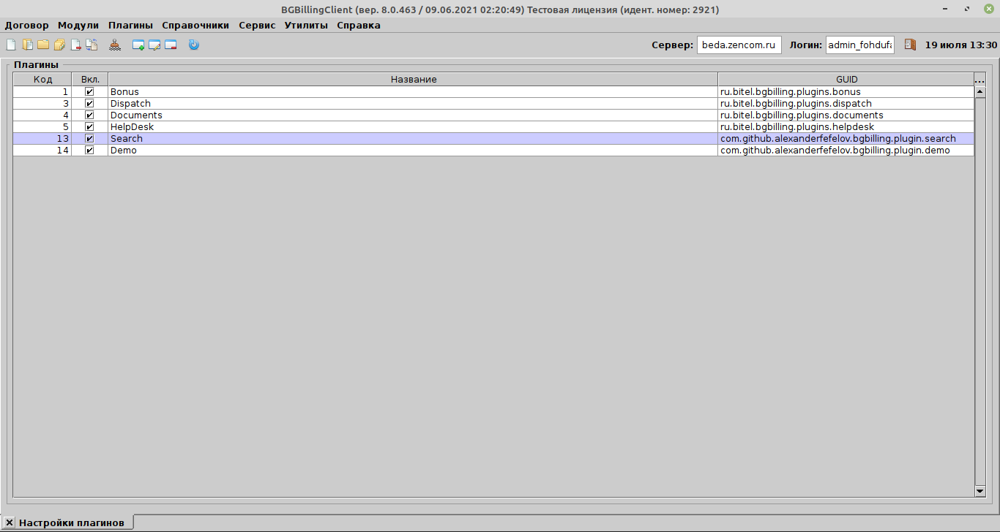
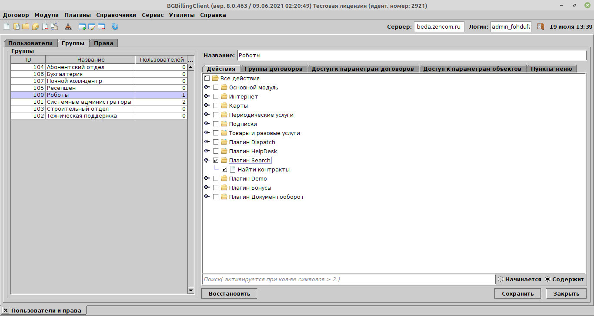
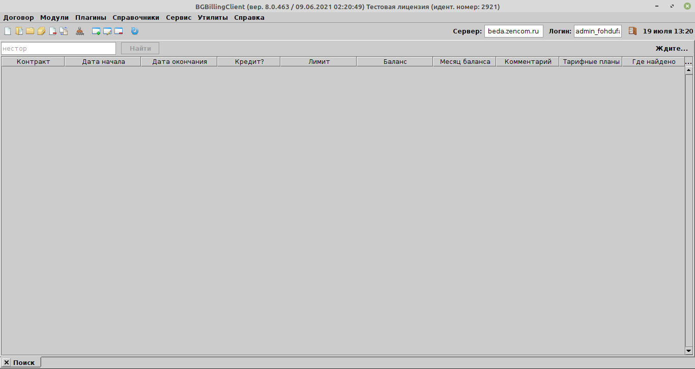
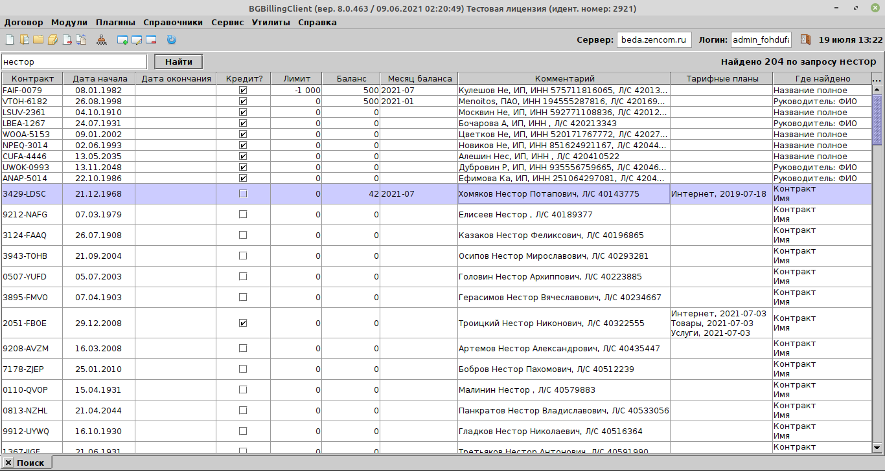

# bgbilling-plugin-search

## Возможности

Поиск производится по всем параметрам контракта типов:

- текстовое поле,
- электронный адрес,
- телефон,

а также по заметкам к контракту, по номеру контракта, комментарию контракта и идентификатору контракта в базе данных.

## Скриншоты










## Сборка

Для сборки необходимы:

- JDK 8 и новее,
- Gradle.

В результате выполнения команды

```
gradle distZip
```

в каталоге `plugin/build/distributions` будет создан zip-файл с дистрибутивом плагина, который можно установить в BGBilling штатными средствами.
